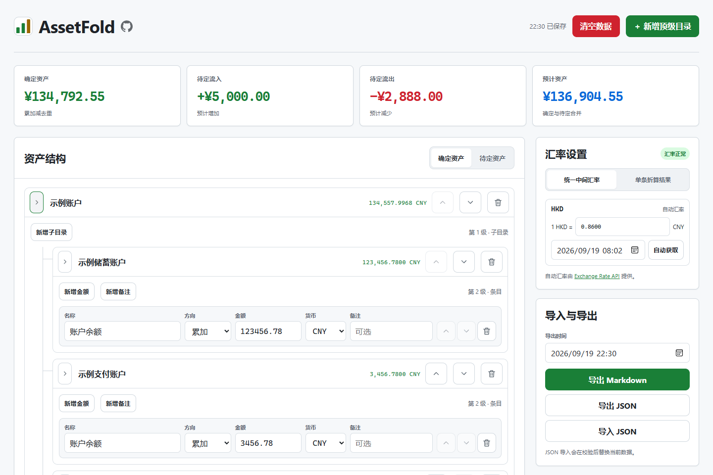
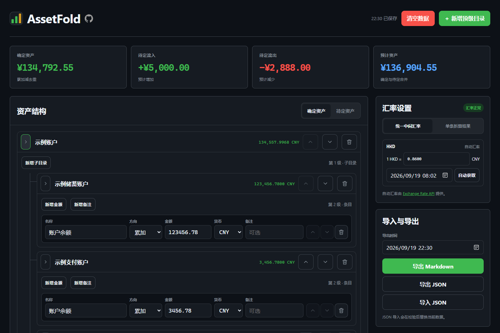
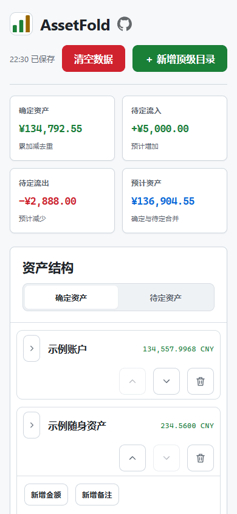
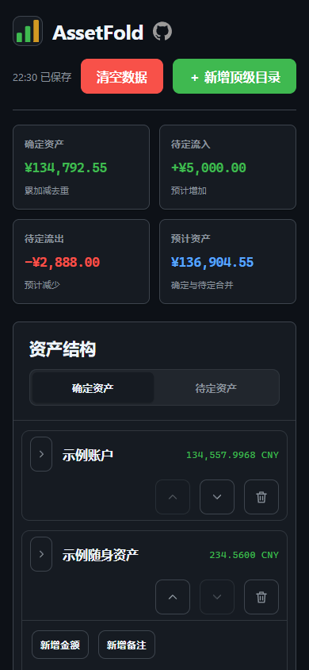

# AssetFold

## 项目简介

AssetFold 是一款纯前端资产快照统计工具，用于整理当前持有及近期预计流入、流出的资产，并统一折算为人民币。

它尤其适合希望了解当下资产状况，或按月、按季度和人生阶段观察积累变化的大学生、初入职场者等用户；同时不限定身份和资产规模，任何希望清晰完成一次资产盘点的人都可以使用。

[在线使用](https://lc6464.github.io/AssetFold/) - [项目仓库](https://github.com/lc6464/AssetFold)

无需注册或安装。资产数据只保存在当前浏览器的本地存储中，不会上传到服务端；自动汇率仅请求公开汇率信息，不会携带资产数据。

如果你觉得 AssetFold 对你有帮助，欢迎在 GitHub 上给项目点个 Star ⭐，或在社交平台分享给更多人。

同时欢迎在 GitHub 上提交问题和建议，或是发起 Pull Request 贡献代码和文档。

## 功能特性

- 分别整理确定资产与待定资产，汇总确定资产、待定流入、待定流出和预计资产
- 使用最多四级目录组织账户、金额与独立备注
- 通过累加和去重处理账户间重复统计的金额
- 支持 CNY、CNH、HKD、USD、MOP、SGD、JPY 等常见货币
- 支持自动获取统一中间汇率，也可以为单条金额直接填写人民币折算结果
- 使用四位定点中间值计算，最终汇总严格向下取整到人民币分
- 自动保存当前填写内容，并提供确认后清空本地数据的操作
- 完整导入、导出 JSON 数据，导出包含目录、小计和备注的 Markdown 快照
- 支持浅色和深色两种主题，适配宽屏和窄屏设备
- 专注于资产快照统计，简约易用，不涉及流水、记账、投资分析等功能

## 开始使用

1. 创建目录，按照账户、平台或资产类型组织结构
2. 添加金额与备注，按需设置货币、方向和折算方式
3. 查看四项汇总，确认当前资产和近期预计变化
4. 导出 JSON 或 Markdown 快照，自行保存，并可交由大模型比较分析

JSON 文件包含完整结构，可重新导入 AssetFold；Markdown 文件适合直接阅读、归档或进行后续分析。

## 界面截图

以下界面均使用合成示例数据。

| | 浅色 | 深色 |
| --- | --- | --- |
| 宽屏端 |  |  |
| 窄屏端 |  |  |

## License

[MIT License](LICENSE)